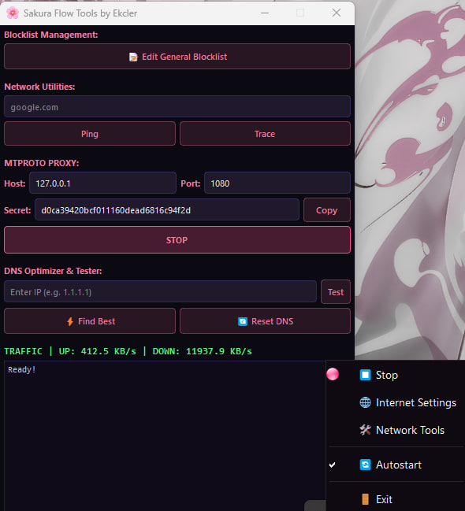

# Sakura Flow 🌸

Приложение в трее рабочего стола для управления [zapret](https://github.com) на Windows.



## Особенности
- **Обход DPI**: Создает Windows-службу из профилей `.bat` zapret для постоянного обхода DPI
- **MTPROTO-прокси**: Встроенный мост-прокси Telegram WebSocket (127.0.0.1:1443)
- **Мульти-прокси**: Поддержка нескольких прокси с автопереключением между ними
- **Сетевые инструменты**: Ping, Tracert и монитор живого трафика (КБ/с)
- **Оптимизатор DNS**: Интеллектуальный тестер DNS (Cloudflare, Google, Yandex, Quad9) с одноразовым применением к Windows
- **Редактор блок-листа**: Редактирование доменов обхода непосредственно из приложения
- **Список исключений**: Домены, которые не будут обрабатываться обходом
- **Карантин**: Автоматическое отслеживание недоступных доменов с возможностью ручного перемещения в обход
- **Управление IPv6**: Включение/отключение IPv6 в один клик
- **Автозапуск**: Интеграция с Планировщиком задач для запуска при входе в систему
- **Обработчик сна/пробуждения**: Автоматически перезапускает службу после выхода компьютера из спящего режима
- **Автодобавление сайтов**: Мониторинг DNS-кэша браузеров и автоматическое добавление недоступных доменов

## Требования
- Python 3.x (протестировано с 3.13)
- Привилегии администратора (требуются для управления службами)
- Windows 10/11

## Быстрый старт

1. Установите зависимости:
```bash
pip install -r requirements.txt
```

2. Запустите от имени администратора:
```bash
python -m src.main
```

> **Примечание:** Приложению требуются привилегии администратора для управления Windows-службами. Оно автоматически запросит повышение прав, если запущено не от имени администратора.

## Сборка

```bash
pyinstaller --onedir --noconfirm --noconsole --name SakuraFlow --manifest manifest.xml --add-data "icons;icons" --add-data "zapret;zapret" --add-data "src;src" --add-data "src/tg_ws_proxy.py;." --icon=icons/moonstone.ico --version-file=version.py src/main.py
```

## Благодарности
- **Flowseal** — за невероятный движок tg-ws-proxy, обеспечивающий связь с Telegram
- **NixNi** — за вдохновение и основную логику интерфейса Sakura Flow и сетевых инструментов