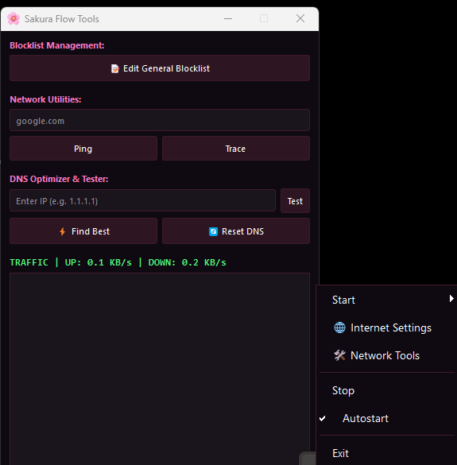

# Sakura Flow 🌸 (Moonstone Fork)
An optimized desktop tray application for managing [zapret](https://github.com) on Windows.



## Key Enhancements in Sakura Flow:
- **Redesigned UI**: Modern "Sakura" dark-pink theme for the system tray menu.
- **Improved UX**: The menu now opens with both **Left-Click (LMB)** and Right-Click (RMB).
- **Portable Mode Fix**: Improved path logic in `config.py`. The compiled `.exe` now correctly locates `zapret` and `icons` folders when placed in the same directory.
- **Enhanced Gaming Support**: Automatic UDP port injection in `service.py` for stable connectivity in games (Rocket League, etc.) with low ping.
- **DNS Flow**: Quick access to Windows Network Settings directly from the menu.

## Quick Start

### Running in Debug Mode
```bash
python -m src.main
```
### Building
```bash
pyinstaller --noconfirm --onefile --windowed --uac-admin --icon "icons/moonstone.ico" --name "SakuraFlow" src/main.py

```
